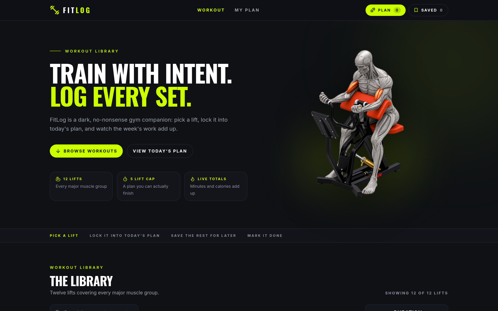
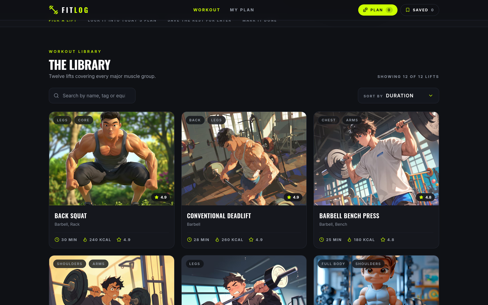
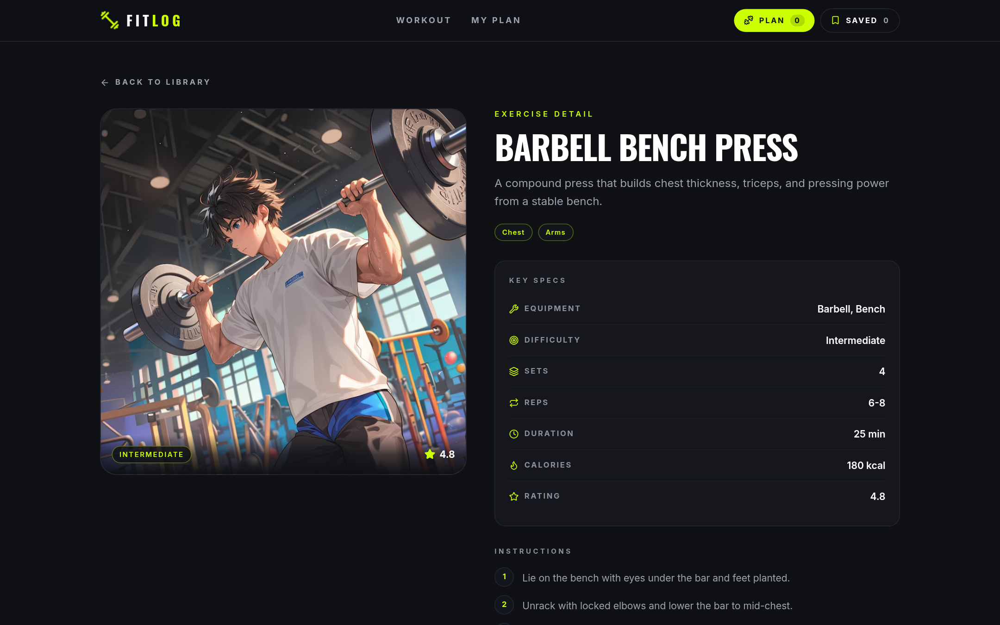
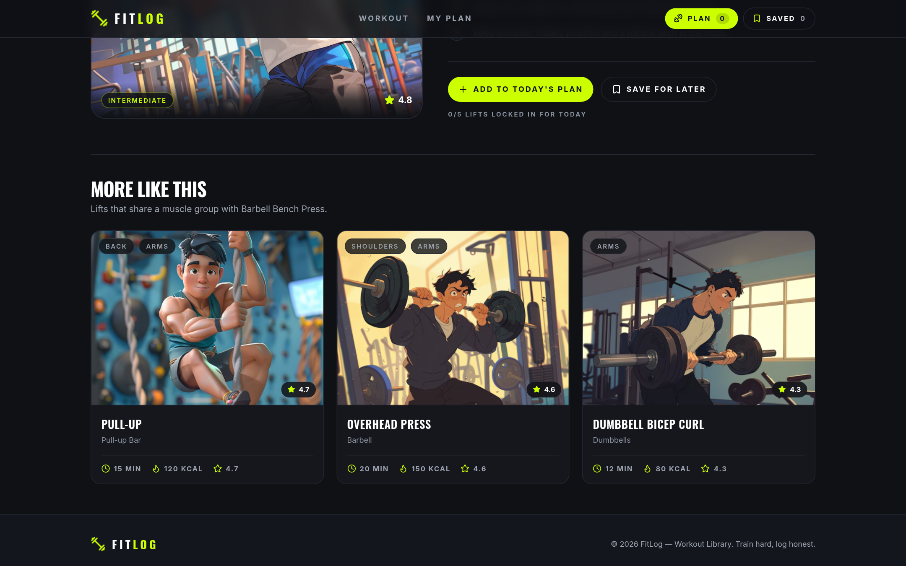
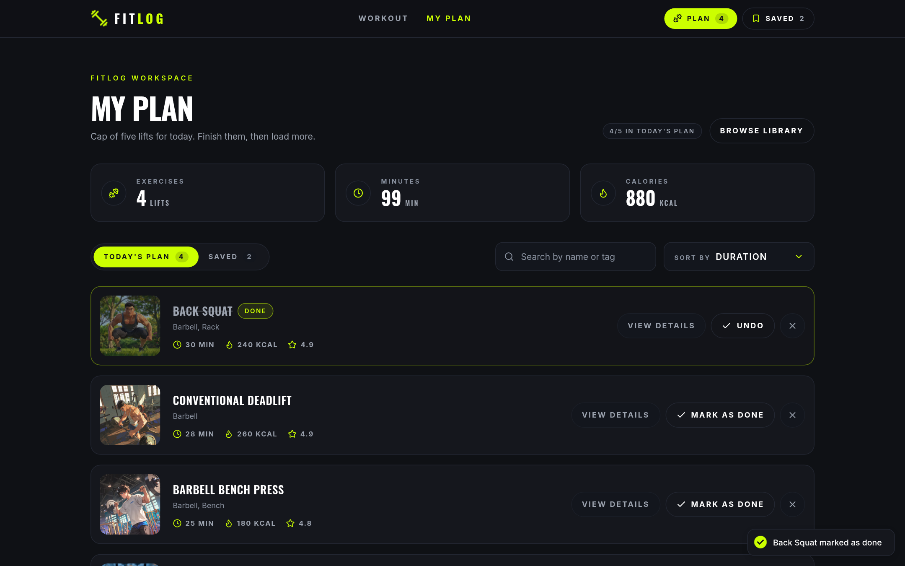
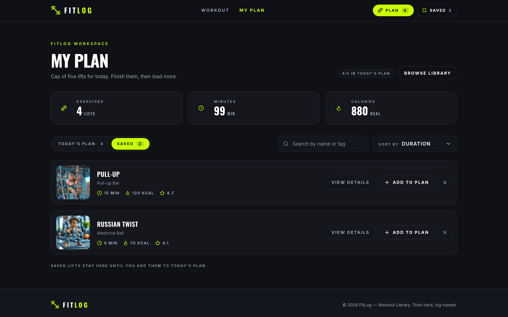
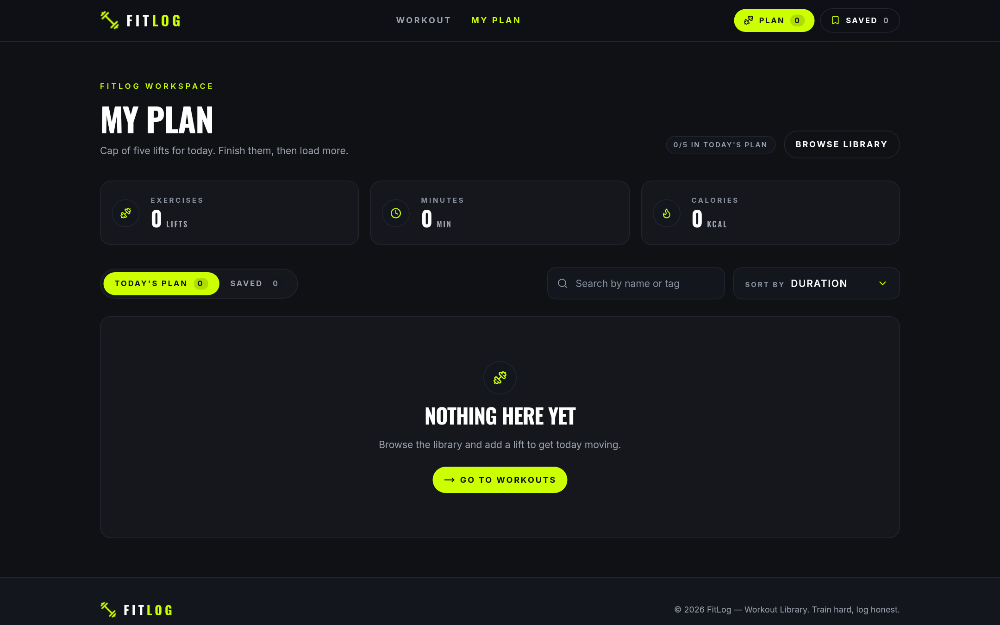
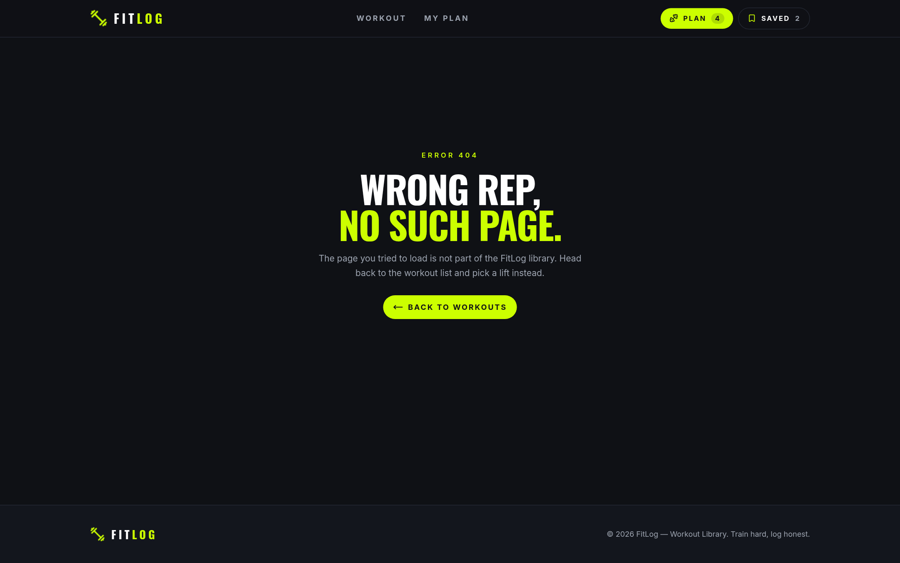
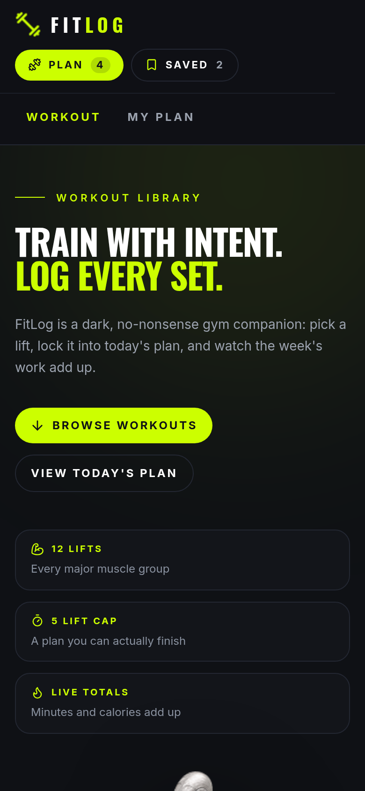
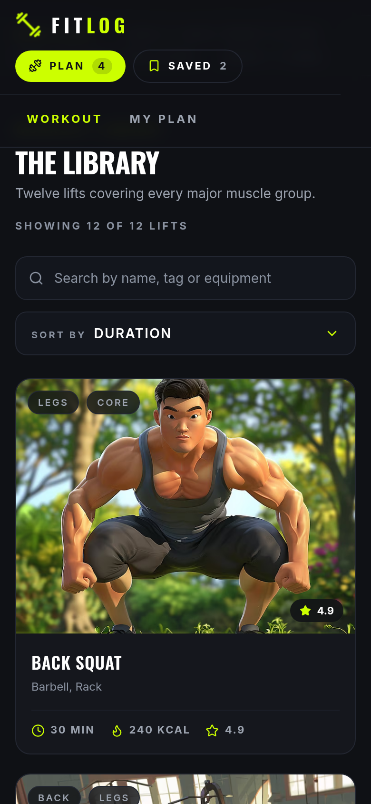

<div align="center">

# 💪 FitLog — Workout Library & Plan Builder

**A dark, no-nonsense gym companion built with the Next.js App Router.**
Pull lifts from an API-driven library, lock up to five of them into today's plan, park the rest in Saved,
and watch your minutes + calories add up in real time.

[](https://nextjs.org/)
[](https://react.dev/)
[](https://tailwindcss.com/)
[](https://www.typescriptlang.org/)

**Repository** · [github.com/annoying-anna/b14-a6-fit-log](https://github.com/annoying-anna/b14-a6-fit-log)<br />
**Live site** · [annoying-anna.github.io/b14-a6-fit-log](https://annoying-anna.github.io/b14-a6-fit-log/)

</div>

---

## 📖 About the project

FitLog is a complete Next.js assignment project (B14-A6) that answers one question: *what am I training today?*

The app consumes the public **FitLog API** (`https://api.abcz.workers.dev/api/fitlog`), renders the twelve lifts as a
responsive card grid, gives every lift a fully server-rendered detail page with key specs + step by step instructions,
and lets a visitor build a capped five-lift plan for the day.

The look and feel follows the supplied Figma / Penpot kit: charcoal `#0f1115` surfaces, hairline `#232732` borders,
Oswald display type and one loud lime accent (`#ccff00`).

---

## 📸 Screenshots

**Home — hero banner, status badges and the BROWSE WORKOUTS call to action**



**The library — twelve lifts in a responsive grid with category pills, equipment and stats**



**Workout details — media column, key specs and step-by-step instructions**

| Detail page | Key specs & instructions |
|-------------|--------------------------|
|  |  |

**My Plan — live metrics, tabs and toast notifications**

| Today's plan (Mark as done + toast) | Saved tab |
|-------------------------------------|-----------|
|  |  |

**Empty state and 404 page**

| Nothing here yet | Wrong rep, no such page |
|------------------|--------------------------|
|  |  |

**Mobile (390 px)**

| Hero | Library |
|------|---------|
|  |  |

---

## ✨ Key features

| # | Feature | What it does |
|---|---------|--------------|
| 1 | **API-driven library** | The home page server-fetches all twelve workouts and renders them in a responsive 3-column grid with image, category pills, equipment and duration/calories/rating stats. |
| 2 | **Dynamic detail pages** | `/workout/[id]` is pre-rendered for every lift with a large visual, the seven-row key specs panel, a numbered instructions list and the two call-to-action buttons. |
| 3 | **Today's plan + Saved list** | Context API state stores the plan (capped at five lifts) and the saved list; the navbar badges, tabs and metric cards all update instantly. |
| 4 | **Search & Sort By** | Free-text search across workout name, equipment and muscle-group tags, plus a chevron dropdown that re-sorts by Duration, Calories or Rating. |
| 5 | **Mark as done & remove** | Planned lifts can be ticked off (line-through + DONE chip) or removed with the X button — every action fires a relevant toast notification. |
| 6 | **localStorage persistence** | The plan, the saved list and the done ticks survive a full page reload (hydrated through `useSyncExternalStore`, so there is no hydration mismatch). |
| 7 | **Loading, empty & 404 states** | Animated loading placeholders while the API resolves (visible on the live site, which fetches the library in the browser), a themed empty state with a **Go to workouts** CTA, a custom 404 page and a global error boundary. |
| 8 | **Responsive by default** | Verified from 390 px phones up to 1440 px desktops — the navbar wraps, the hero stacks, the grid collapses and nothing overflows. |

---

## 🗺️ Routes

| Route | Rendering | Description |
|-------|-----------|-------------|
| `/` | Dynamic server render | Hero/banner + **THE LIBRARY** section with search and sort |
| `/my-plan` | Static shell + client state | Metric cards, **Today's Plan** / **Saved** tabs, plan actions |
| `/workout/[id]` | Pre-rendered + ISR (5 min) | Detail page for a single lift, 404 for unknown ids |
| `*` | Static | Custom 404 page |

---

## 🛠️ Tech stack

| Technology | Purpose |
|-----------|---------|
| **Next.js 16 (App Router)** | Server Components, dynamic routing, metadata, ISR |
| **React 19** | Client Components, `useState` / `useEffect` / `useMemo`, Context API, `useSyncExternalStore` |
| **TypeScript (strict)** | Typed API contract and component props |
| **Tailwind CSS v4** | Design tokens via `@theme`, responsive layout, component classes |
| **react-hot-toast** | Toast notifications for every plan/saved action |
| **lucide-react** | Consistent icon set (clock, flame, star, check, X, chevrons…) |
| **next/font (Oswald + Inter)** | Self-hosted display and body typography |
| **ESLint (next/core-web-vitals)** | Zero-warning linting |

---

## 🚀 Getting started

```bash
# 1. install dependencies
npm install

# 2. start the dev server
npm run dev
# open http://localhost:3000

# 3. production build + local production server
npm run build && npm run start

# 4. lint the project
npm run lint
```

### Environment variables (optional)

The API base URL falls back to the public FitLog endpoint, so the app runs with **zero configuration**.
To point it somewhere else, copy `.env.example` to `.env.local`:

```bash
NEXT_PUBLIC_FITLOG_API_URL=https://api.abcz.workers.dev/api/fitlog
```

---

## 🔌 API reference

| Endpoint | Returns |
|----------|---------|
| `GET https://api.abcz.workers.dev/api/fitlog` | All twelve workouts as an array |
| `GET https://api.abcz.workers.dev/api/fitlog/:id` | A single workout, or `404` for an unknown id |

```ts
type Workout = {
  id: number; name: string; image: string;
  muscleGroups: string[]; equipment: string; difficulty: string;
  duration: number; caloriesBurned: number;
  sets: number; reps: string; rating: number;
  description: string; instructions: string[];
};
```

Network failures never crash the page: `lib/api.ts` degrades to an empty library, and the home page shows a
friendly "Library unavailable" panel with a reload action.

---

## 🗂️ Project structure

```
fit-log/
├── app/
│   ├── layout.tsx              # fonts, navbar, footer, toaster, PlanProvider, metadata
│   ├── page.tsx                # home — hero + library (server or client fetched)
│   ├── loading.tsx             # "Loading workouts…" animation + skeleton grid
│   ├── not-found.tsx           # custom 404
│   ├── error.tsx               # global error boundary
│   ├── my-plan/page.tsx        # My Plan route (metadata) -> MyPlanView
│   └── workout/[id]/
│       ├── page.tsx            # detail page + generateStaticParams + generateMetadata
│       └── loading.tsx         # detail skeleton
├── components/                 # Navbar, Footer, Hero, LibrarySection, WorkoutCard,
│                               # SortDropdown, SearchInput, PlanWorkoutCard, StatCard,
│                               # EmptyState, WorkoutDetailActions, MyPlanView,
│                               # LibrarySkeleton, LibraryUnavailable, PublicImage
├── context/PlanContext.tsx     # Context API wrapper + toast feedback
├── lib/
│   ├── api.ts                  # FitLog API client (resilient fetch)
│   ├── plan-store.ts           # external store: plan / saved / done + localStorage
│   ├── sort.ts                 # sort options, sorting + search helpers
│   ├── format.ts               # titleCase, pluralize
│   ├── public-path.ts          # base-path helper for /public files
│   ├── constants.ts            # API url, PLAN_LIMIT (5), storage key
│   └── types.ts                # Workout, SortKey, PlanTotals, PlanTab
├── screenshots/                # images used in this README
├── .github/workflows/          # deploy-pages.yml — static export for the live preview
└── public/                     # fitlog-logo.png, fitlog-banner.png, .nojekyll
```

---

## 🎨 Design tokens

| Token | Value | Used for |
|-------|-------|----------|
| `--color-ink` | `#0f1115` | Page background |
| `--color-panel` | `#15171d` | Cards, panels |
| `--color-line` | `#232732` | Hairline borders |
| `--color-accent` | `#ccff00` | CTAs, active links, Plan badge, highlights |
| `--color-muted` | `#9ca3af` | Secondary copy |
| `--font-display` | Oswald | Uppercase display headings |
| `--font-sans` | Inter | Body copy |

---

## ☁️ Deployment

1. Push this repository to GitHub (already done if you are reading it there).
2. Import the repo on **Vercel** (or Netlify / Cloudflare Pages).
3. Framework preset: **Next.js** — no extra configuration, no environment variables required.
4. Build command `npm run build`, output handled automatically.
5. After deploying, check `/`, `/my-plan`, `/workout/1`, a hard reload on a dynamic route, and a mobile viewport.

### Hosted preview (GitHub Pages)

The very same commit is also published by [`.github/workflows/deploy-pages.yml`](.github/workflows/deploy-pages.yml) to
**https://annoying-anna.github.io/b14-a6-fit-log/**

The workflow builds with `NEXT_STATIC_EXPORT=1 NEXT_BASE_PATH=/b14-a6-fit-log`, which switches
`next.config.ts` into a fully static export (`output: "export"`, `trailingSlash: true`, unoptimized images).
Vercel — or any Node host — builds the repository as-is and keeps server rendering + ISR, so no environment
variables are needed for the primary deployment.

### Requirement coverage

- ✅ Navbar with logo, active link highlight, filled **Plan** badge and outlined **Saved** badge
- ✅ Hero with eyebrow, display heading, subtitle, anchor CTA to `#library` and banner visual
- ✅ Library grid (12 cards, 3 columns on large screens) with images, pills, equipment and stats
- ✅ Detail page with visual, tags, 7-row specs panel, 4-step instructions and both CTAs
- ✅ Toasts + badge counters + live My Plan metrics, tabs, loading state and empty state
- ✅ Custom 404 page, home loading animation, global error boundary, dark footer
- ✅ Challenge C1 (Sort By dropdown), C2 (this README), C3 (Mark as done + X remove)
- ✅ Optional extras: localStorage persistence, search, five-lift plan cap


---

## 📝 Notes

- Invalid workout ids (`/workout/999`) render this project's custom 404 page. Next.js streams dynamic
  segments, so that response keeps a `200` status; genuinely unknown routes (`/anything-else`) answer with a
  real `404`.
- The plan / saved list / done ticks live in `localStorage` under `fitlog:plan` and are hydrated through
  `useSyncExternalStore`, which keeps the server markup and the first client render identical.
- `lib/api.ts` treats a network failure as an empty library instead of an exception, so an API outage degrades
  to a friendly message rather than a crashed page.

---

## 👤 Author

**B14-A6 Fit Log** — individual assignment submission.

| | |
|---|---|
| **GitHub** | [@annoying-anna](https://github.com/annoying-anna) |
| **Live site** | [annoying-anna.github.io/b14-a6-fit-log](https://annoying-anna.github.io/b14-a6-fit-log/) |
| **Built with** | Next.js 16 (App Router) · React 19 · TypeScript · Tailwind CSS v4 |
| **Data source** | [api.abcz.workers.dev/api/fitlog](https://api.abcz.workers.dev/api/fitlog) |
